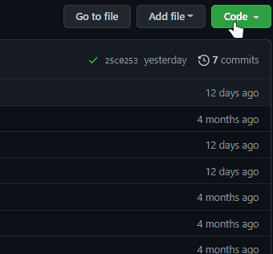

# Mockup for company

An website use GitPage for hosting, CSS, Tailwind, HTML, JQuery and JS. Plugins Slick slider, Video js.

## Project Status

This project is currently done. Users can 

## Project Screen Shots

## Installation and Setup Instructions

Open [https://avalanche322.github.io/mockup-for-company/](https://avalanche322.github.io/mockup-for-company/) to view it in the browser.

Clone down this repository. You will need firebase account and `node`, `npm` installed globally on your machine.

Installation:

Clone repository

`git clone https://github.com/Avalanche322/mockup-for-company.git`  

Open folder

`cd mockup-for-company`

Install node modules:

`npm install`

To Start Server:

`npm i live-server`

`live-server`  

To Visit App:

`http://127.0.0.1:8080` 
